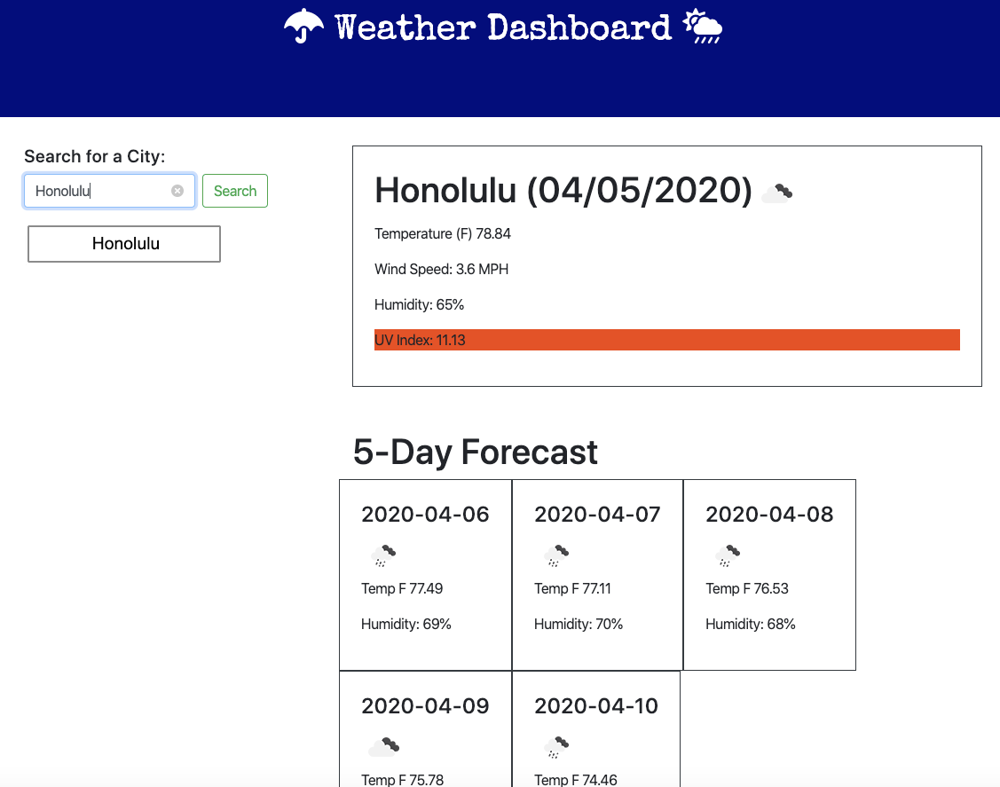

# Weather_Dashboard

1) Goals and Methods
- Using Bootstrap, Javascript, jquery and the OpenWeatherAPI, I have created a weather dashboard that will always keep you in the loop! There are many things this dashboard does and it has some cool features. There is a current day forecast, a 5 day forecast and a UV index that will let you know when to apply the sunscreen. Please enjoy for daily use!

2) Technologies
- HTML
- CSS
- Bootstrap
- Javascript
- jQuery
- OpenWeather API

3) Installation
- No installation required. Here is the link to the site: https://ksmera01.github.io/Weather_Dashboard/

4) Screenshots
